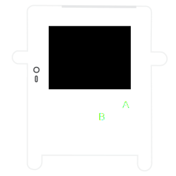
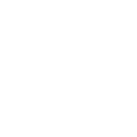
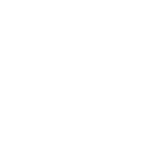
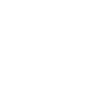

<h1 align="center" class="fs-10">Welcome to Pokitto Guidebook!</h1>

Pokitto Guidebook is a collection of information about Pokitto and how it works.

<h1 align="center">What is Pokitto?</h1>

    

        
    

    

        

            POKITTO is a Do-It-Yourself gaming gadget, that you assemble and program yourself.
            With Pokitto, you can learn programming & building electronics in a fun way!
            and you can play exclusive and free games made by our wonderful community
        

        <a href="{{ site.url }}{{ site.baseurl }}/pokitto">Read more...</a>
    

<h1 align="center">Getting Started</h1>

    Using the Pokitto for the first time is easy! First you need to start by assembling your Pokitto Follow these steps below to get started with your Pokitto!

    

        <a href="{{ site.url }}{{ site.baseurl }}/start/Assembling%20the%20pokitto.html" >
            
            

                <a href="{{ site.url }}{{ site.baseurl }}/start/Assembling%20the%20pokitto.html" class="btn">Assemble Pokitto</a>
            

        </a>
    

    

        <a href="{{ site.url }}{{ site.baseurl }}/start/play">
            
            

                <a href="{{ site.url }}{{ site.baseurl }}/start/play" class="btn">Download & Play Games</a>
            

        </a>
    

    

        <a href="{{ site.url }}{{ site.baseurl }}/start/learn">
            
            

                <a href="{{ site.url }}{{ site.baseurl }}/start/learn" class="btn">Make your First Games</a>
            

        </a>
    

<h1 align="center">Didn't find what you were looking for?</h1>

    We have a very active and helpful community, you can ask questions in the pokitto forum or live chat at Discord.

    

        <a href="https://talk.pokitto.com/">
            
            

                <a href="https://talk.pokitto.com/" class="btn">Join Commmunity</a>
            

        </a>
    

    

        <a href="https://discord.gg/Vn4ujU">
            
            

                <a href="https://discord.gg/Vn4ujU" class="btn">Live Chat</a>
            

        </a>
    

