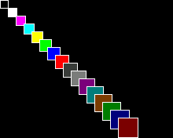

## clear()

## Description
Clear the whole screen with the background color setted with [setColor()]({{site.url}}{{site.baseurl}}/library/display/setcolor)


## Example

<div class="code-example" markdown="1">
**main.cpp**
</div>


```cpp
#include "Pokitto.h"

void update() {
    using PD = Pokitto::Display;

    PD::setColor(0, 3);
    PD::clear(); //Clear with backcolor 3
    PD::fillRectangle(42, 42, 42, 42); //Draw Rectangle with color 0
}
```

Project settings
<div class="code-example" markdown="1">
**My_settings.h**
</div>

```
#define PROJ_SCREENMODE MODE15
```

<div style="min-width: 33.33%">
    
</div>
