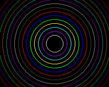

## drawCircle(int16_t  x, int16_t  y, int16_t  r)

## Description

Draws the borders of a circle using the current color (you can choose index color with [setColor()]({{site.url}}{{site.baseurl}}/library/display/setcolor)).
The coordinate system is the one usually used in most of computer display, with the origin point (0,0) located at the top left corner of the display.

## Parameters

### x
The x coordinate of the circle center

### y
The y coordinate of the circle center

### r
The radious of the circle to be draw

## Example

<div class="code-example" markdown="1">
**main.cpp**
</div>


```cpp
#include "Pokitto.h"
#include <cmath>

float angle = 0;

void update() {
    using PD = Pokitto::Display;

    int color = 0;
    for (float i = 0; i < PI * 2; i += PI / 16.0) {
        int w = std::sin(angle + i) * 64;
        int h = std::cos(angle + i) * 64;
        PD::setColor(color++);
        PD::drawRectangle(PD::width / 2, PD::height / 2, w, h);
    }

    angle += PI/100.0;
}
```

Project settings
<div class="code-example" markdown="1">
**My_settings.h**
</div>

```
#define PROJ_SCREENMODE MODE15
```

<div style="min-width: 33.33%">
    
</div>
