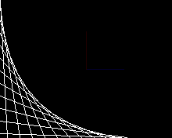

How to draw a line.

## drawLine(uint8_t x0, uint8_t y0, uint8_t x1, uint8_t y1)

Draws a line of the current color (you can choose index color with [setColor()]({{site.url}}{{site.baseurl}}/library/display/setcolor)).
The coordinate system is the one usually used in most of computer display, with the origin point (0,0) located at the top left corner of the display.

## Parameters

### x0
The x coordinate in the screen from where the line will start. 

### y0
The y coordinate in the screen from where the line will start. 

### x1
The x coordinate in the screen where the line will end.

### y1
The y coordinate in the screen where the line will end.

## Example

<div class="code-example" markdown="1">
**main.cpp**
</div>


```cpp
#include "Pokitto.h"

constexpr int step = 16;
constexpr int axisLenght = 48;
int offset = 0;

void update() {
    using PD = Pokitto::Display;

    //X Axis from center of screen
    PD::setColor(6); //Set color red
    PD::drawLine(PD::width / 2, PD::height / 2, PD::width / 2 + axisLenght, PD::height / 2);

    //Y Axis from center of screen
    PD::setColor(7); //Set color blue
    PD::drawLine(PD::width / 2, PD::height / 2, PD::width / 2, PD::height / 2 - axisLenght);

    //Bottom corner draw
    PD::setColor(1); //Set color white
    for (int y = offset - step; y < PD::height; y += step) {
        PD::drawLine(0, y, y + step, PD::height);
    }
    offset++;
    offset %= step;
}
```

Project settings
<div class="code-example" markdown="1">
**My_settings.h**
</div>

```
#define PROJ_SCREENMODE MODE15
```

<div style="min-width: 33.33%">
    
</div>
