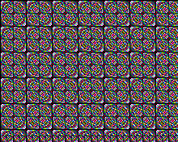

Draw a single point (pixel) in the screen specific coordinate

## drawPixel(int16_t x, int16_t y)

## drawPixel(int16_t x, int16_t y, uint8_t col)

## drawPixelRaw(int16_t x, int16_t y, uint8_t col)

## drawPixelNOP(int16_t x, int16_t y, uint8_t col)

Draws a line of the current color (you can choose index color used with [setColor]({{site.url}}{{site.baseurl}}/library/display/setcolor)).

## Parameters

### x0
The x coordinate where draw the pixel. 

### y0
The y coordinate where draw the pixel.


## Example

<div class="code-example" markdown="1">
**main.cpp**
</div>


```cpp
#include "Pokitto.h"

uint8_t i = 0;

void update() {
    using PD = Pokitto::Display;

    for (int x = 0; x < PD::width; x++) {
        for (int y = 0; y < PD::height; y++) {
            PD::drawPixel(x, y, ((x * y) / i) % 16); //draw pixel at x and y with a color
        }
    }
    i++;
}
```

Project settings
<div class="code-example" markdown="1">
**My_settings.h**
</div>

```
#define PROJ_SCREENMODE MODE15
```

<div style="min-width: 33.33%">
    
</div>
