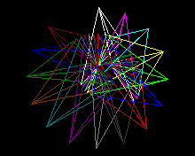

## drawTriangle((int16_t x0, int16_t y0, int16_t x1, int16_t y1, int16_t x2, int16_t y2)

## Description

Draws the borders of a triangle using the current color (you can choose index color with [setColor()]({{site.url}}{{site.baseurl}}/library/display/setcolor)).
The coordinate system is the one usually used in most of computer display, with the origin point (0,0) located at the top left corner of the display.

## Parameters

### x0
The x coordinate of the first corner of the triangle

### y0
The y coordinate of the first corner of the triangle

### x1
The x coordinate of the second corner of the triangle

### y1
The y coordinate of the second corner of the triangle

### x2
The x coordinate of the third corner of the triangle

### y2
The y coordinate of the third corner of the triangle


## Example

<div class="code-example" markdown="1">
**main.cpp**
</div>


```cpp
#include "Pokitto.h"
#include <cmath>

float angle = 0;

void update() {
    using PD = Pokitto::Display;

    int color = 0;
    for (float r = 0; r < PI * 2.0; r += PI / 16.0) {

        PD::setColor(color++);

        int x0 = PD::width / 2 + std::sin(angle + r) * 20.0;
        int y0 = PD::height / 2 + std::cos(angle + r) * 20.0;

        int x1 = PD::width / 2 + std::sin((angle + r )/ 2.0) * 50.0;
        int y1 = PD::height / 2 + std::cos((angle + r) / 2.0) * 50.0;

        int x2 = PD::width / 2 + std::sin((angle - r) * 2) * 80.0;
        int y2 = PD::height / 2 + std::cos((angle - r) * 2) * 80.0;

        PD::drawTriangle(x0, y0, x1, y1, x2, y2);
    }
    angle += PI / 100.0;
}
```

Project settings
<div class="code-example" markdown="1">
**My_settings.h**
</div>

```
#define PROJ_SCREENMODE MODE15
```

<div style="min-width: 33.33%">
    
</div>
