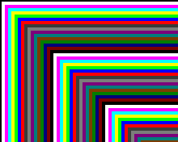

## uint8_t getPixel(int16_t x, int16_t y)

## Description
Get pixel color at specific coordinate. The color is returned as index of the color from the palette in use.

## Parameters

### x
The x coordinate where read the pixel color. 

### y
The y coordinate where read the pixel color.

## Returned value (uint8_t color)
Color at specific coordinate 


## Example

<div class="code-example" markdown="1">
**main.cpp**
</div>


```cpp
#include "Pokitto.h"

void update() {

    using PD = Pokitto::Display;

    for (int x = 2; x < PD::width; x++) {
        for (int y = 2; y < PD::height; y++) {
            uint8_t color = PD::getPixel(x - 4, y - 4);
            PD::drawPixel(x, y, ((color + 1)) % 16);
        }
    }
}
```

Project settings
<div class="code-example" markdown="1">
**My_settings.h**
</div>

```
#define PROJ_SCREENMODE MODE15
```

<div style="min-width: 33.33%">
    
</div>
