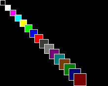

## setColor(uint8_t foregroundColor)

## setColor(uint8_t foregroundColor, uint8_t backGroundColor)

## Description
Choose the color that will be used for the subsequent drawing calls, it comes in two flavours if you need to set also the background color in just one call.
It's important to highlight that the color is passed as **index of the colour** in the palette in use.
Is possible to load a different palette with [load565Palette()]({{site.url}}{{site.baseurl}}/library/display/load565palette) or [loadRGBPalette()]({{site.url}}{{site.baseurl}}/library/display/loadrgbpalette)

## Parameters

### foregroundColor
The index of the color in the palette that will be used by all the drawing routines 

### backGroundColor
The index of the color in the palette that will be used for [clear()]({{site.url}}{{site.baseurl}}/library/display/clear) the screen or as background for text print. 


## Example

<div class="code-example" markdown="1">
**main.cpp**
</div>


```cpp
#include "Pokitto.h"

constexpr int squareSize = 10;

void update() {
    using PD = Pokitto::Display;

    for (int color = 0; color < 16; color++) {
        PD::setColor(color); //Set color for fill the rectangle 
        PD::fillRectangle(color * squareSize, color * squareSize, squareSize+color, squareSize+color);
        PD::setColor(1); //Set color for draw rectangle border
        PD::drawRect(color * squareSize, color * squareSize, squareSize+color, squareSize+color);
    }
}

```

Project settings
<div class="code-example" markdown="1">
**My_settings.h**
</div>

```
#define PROJ_SCREENMODE MODE15
```

<div style="min-width: 33.33%">
    
</div>
