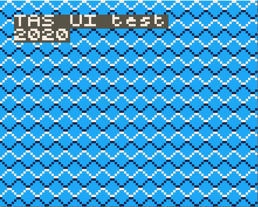

## printInteger(number)

Prints the integer number to the current cursor position.

## Parameters

### number
The number for printing.

## Example

<div class="code-example" markdown="1">
**main.py**
</div>

```py
import upygame as pygame
from upygame import TAS

# Setup the screen buffer
pygame.display.init(False)

# PICO-8 palette
# TAS UI uses always the the colors 1-3. The color 0 is transparent for the UI.
pygame.display.set_palette_16bit([0x0000, 0x5aa9 , 0xf809 , 0xff7c, 0xa286, 0x0429, 0xbe18, 0x194a,0xfd00,  0x0706, 0xff44, 0x792a, 0x255f, 0x7392, 0xfbb4, 0xfe54]);

screen = pygame.display.set_mode() # full screen

# Map, 8x8 tiles. All tile id's are zero.
mapPixels1 = bytearray(16*16)

# Tile, 8x8 pixels.
diamond8Pixels = b'\
\xcc\xc3\x3c\xcc\
\xcc\x3c\xc3\xcc\
\xc3\xcc\xcc\x3c\
\x3c\xcc\xcc\xc3\
\x7c\xcc\xcc\xc7\
\xc7\xcc\xcc\x7c\
\xcc\x7c\xc7\xcc\
\xcc\xc7\x7c\xcc\
'

# Initialise the tilemap.
tilemap = pygame.tilemap.Tilemap(16, 16,mapPixels1)
tilemap.set_tile(0x0, 8, 8, pygame.surface.Surface(8, 8, diamond8Pixels));

# Draw a text and a number.
TAS.setCursor(1, 1)
TAS.printString("TAS UI test")
TAS.setCursor(1, 2)
TAS.printInteger(2020)

# The main loop
while True:

    # Draw the tilemap
    tilemap.draw(0, 0)

    # Update the screen.
    pygame.display.flip()
```

The Pokitto Online Edit
<div class="code-example" markdown="1">
**The Pokitto Online Editor settings**
</div>

```
Resolution: TAS low
TAS Tile Width: 8
TAS Tile Height: 8
TAS Maximum Sprites: 100
```

<div style="min-width: 33.33%">
    
</div>
