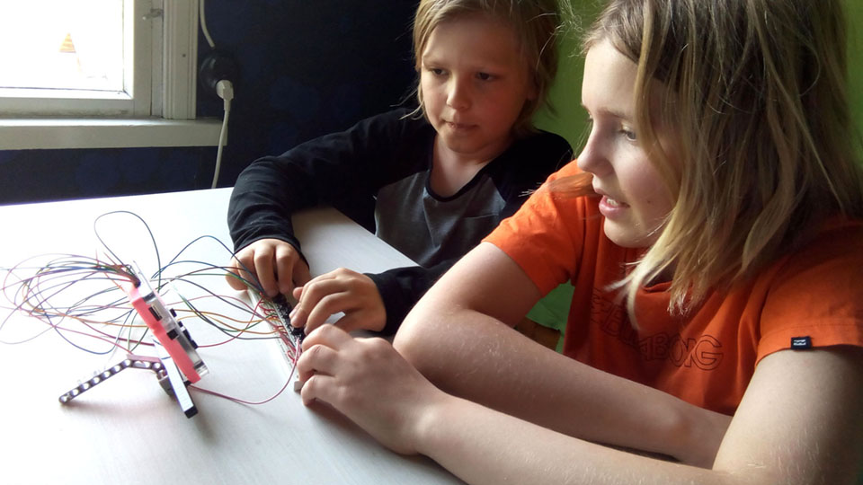
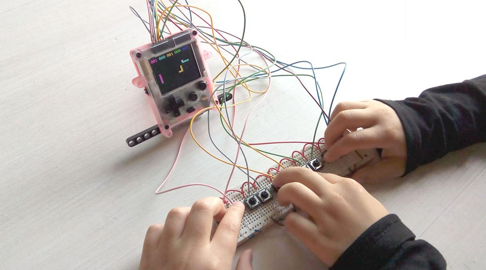
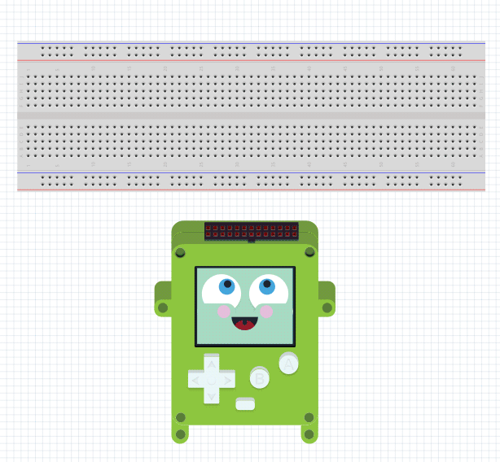

<h2 align="center" class="bg-yellow-300 py-3">POKITTO IS A Do-IT-YOURSELF GAMING GADGET</h2>

Pokitto can be bought ready-made or as a simple kit – if you want, you can build your OWN Pokitto!

<a href="https://www.pokitto.com/purchase/" class="btn mt-5">Order Your Pokitto !</a>

<h2 align="center" class="bg-yellow-300 py-3">POKITTO COMBINES GAMES AND ELECTRONICS TO GET KIDS INTERESTED</h2>

With POKITTO you learn by playing and looking at open-source games and applications.
Then create your own programs and move on to build intelligent gadgets – it’s a motivating way of learning for both kids and adults!

<h2 align="center" class="bg-yellow-300 py-3">POKITTO MAKES LEARNING ELECTRONICS FUN</h2>

POKITTO is a Do-It-Yourself gaming gadget, that you assemble and program yourself.
With Pokitto, you can learn programming & building electronics in a fun way!

<h2 align="center" class="bg-yellow-300 py-3">POKITTO HAS A HELPFUL AND ACTIVE COMMUNITY</h2>

We have a very active and helpful community.
WE HAVE NO “STUPID QUESTIONS”
Beginner and expert questions are all treated with equal respect!

<a class="btn" href="http://talk.pokitto.com">Join the Pokitto Community now!</a>

<h2 align="center" class="bg-green-000 py-3">OUR MISSION</h2>
POKITTO IS YOUR path to mastering the Internet-of-Things
Pokitto is a full-featured ARM development platform. If you learn to program the Pokitto, you have inside knowledge on how smart Internet of Things gadgets really operate. There will be TENS of BILLIONS of devices like the Pokitto in our homes, cars and workplaces in the near future.

We believe the future will be better if not just engineers but kids, teachers, and ordinary people of all kinds of background are able to design the smart future. Pokitto is our contribution to this vision.

Jonne & Daniel