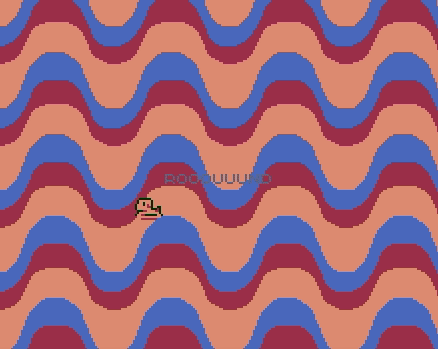
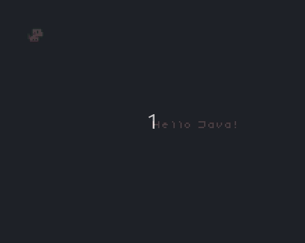

## Hello Java! 

Starting up the Hello Java project in Femto IDE will bring you first to the `Main.java` page. 
When you run this project (Build -> Build & Run) the Pokitto Emulator will start and you should see the following: 

<div style="min-width: 33.33%">
    
</div>

You will see there is a lot going on here. So lets clear it out so the only pieces we have left are as shown:

<div class="code-example" markdown="1">
**Main.java**
</div>

```Java
import femto.mode.HiRes16Color;
import femto.Game;
import femto.State;
import femto.input.Button;
import femto.palette.Psygnosia;
import femto.font.TIC80;

class Main extends State {
    
    public static void main(String[] args){
        Game.run( TIC80.font(), new Main() );
    }
    
    void init(){
    }
    
    void update(){

    }
    
}

```

#### The Main class

Our class is called Main and extends a class `State` where we get the methods `init()` and `update()`. You can find more info on [Game and State here](https://github.com/felipemanga/femtoide/wiki/Game-And-State)

In `main(String[] args)` there is a static call to `Game.run( TIC80.font(), new Main() );`. This is where our game is started, by setting the initial state to our class `new Main()` and using the `TIC80.font()` for the Main font. 

It is then advised to do all our initializations in the `init()` method. 

Then to actually run the game, we put our logic in `update()` which is called every frame by the same `Game` that we used in main to run. 

#### Screen

One of the main things we will use a lot in Java games is the Screen object. It is used to configure the display output and to ultimately print to the screen. So lets add a screen object. You can find more info on [HiRes16Color screenmode here](https://github.com/felipemanga/femtoide/wiki/femto.mode.HiRes16Color)

<div class="code-example" markdown="1">
**Main.java**
</div>

```Java
import femto.mode.HiRes16Color;
import femto.Game;
import femto.State;
import femto.input.Button;
import femto.palette.Psygnosia;
import femto.font.TIC80;

class Main extends State {

    HiRes16Color screen; 
    
    public static void main(String[] args){
        Game.run( TIC80.font(), new Main() );
    }
    
    void init(){
        screen = new HiRes16Color(Psygnosia.palette(), TIC80.font());
    }
    
    void update(){
        
        screen.flush();
    }
    
}

```

First we declare our `screen` object as a type `HiRes16Color`. This is because we are using the HiRes16Color screen mode for our game.

We then initialize it in the `init()` method, setting the constructor parameters for the palette and font. ` screen = new HiRes16Color(Psygnosia.palette(), TIC80.font());`. You can read more about [Palettes](https://github.com/felipemanga/femtoide/wiki/femto.palette) and [Fonts](https://github.com/felipemanga/femtoide/wiki/femto.font) on the Femto IDE wiki.

The part that actually draws everything to the display is the `screen.flush();` which we add to the end of the `update()` method. This can be called from anywhere in your game logic, but for now we call it here so everything gets flushed one time at the end of the update method.

Still nothing too exciting, so lets add some text to the screen!

#### Screen Text

To draw some text to the screen, we will need to configure where we want it, and which color to use to draw the text. In Java projects, the game mode uses 16 color palettes.

Lets first set the position of our text: `screen.setTextPosition(screen.width()/2, screen.height()/2);`

Notice I also used the methods `width()` and `height()` on the screen object. These give us the dimentions of the screen. I then divide them in half to start the text in the middle of the screen.

Setting the color: `screen.setTextColor(10);` 

And ultimately, printing to the screen the text: `screen.print("Hello Java!");`

With our Main class now looking like this:

<div class="code-example" markdown="1">
**Main.java**
</div>

```Java
import femto.mode.HiRes16Color;
import femto.Game;
import femto.State;
import femto.input.Button;
import femto.palette.Psygnosia;
import femto.font.TIC80;

class Main extends State {

    HiRes16Color screen; 
    
    public static void main(String[] args){
        Game.run( TIC80.font(), new Main() );
    }
    
    void init(){
        screen = new HiRes16Color(Psygnosia.palette(), TIC80.font());
    }
    
    void update(){
        
        screen.setTextPosition(screen.width()/2, screen.height()/2);
        screen.setTextColor(10);
        screen.print("Hello Java!");
        
        screen.flush();
    }
    
}
```

When we run, we will see `Hello Java!` printed to the screen! 

#### Input

That's fun to see stuff on the screen, but what about input? 

Lets make a little puppy that we can move around the screen with the d-pad. Femto IDE makes sprites very easy. With an sprite sheet and an aseprite exported json file, FemtoIDE will automatically convert them into a sprite object with the name of the json file. If you were looking at the template when you started a new Java project, you would see the `Dog` object which is created from the `Dog.json` file. You can read a bit more [on sprites here](https://github.com/felipemanga/femtoide/wiki/femto.Sprite)

In our project, lets add the Dog

<div class="code-example" markdown="1">
**Main.java**
</div>

```Java
import femto.mode.HiRes16Color;
import femto.Game;
import femto.State;
import femto.input.Button;
import femto.palette.Psygnosia;
import femto.font.TIC80;

class Main extends State {

    HiRes16Color screen; 
    
    Dog dog;
    
    public static void main(String[] args){
        Game.run( TIC80.font(), new Main() );
    }
    
    void init(){
        screen = new HiRes16Color(Psygnosia.palette(), TIC80.font());
        dog = new Dog();
        dog.run();
    }
    
    void update(){
        screen.clear(0);
        
        screen.setTextPosition(screen.width()/2, screen.height()/2);
        screen.setTextColor(10);
        screen.print("Hello Java!");
        
        dog.draw(screen, 10, 10);
        
        screen.flush();
    }
    
}
```

Like the screen object, we have our `Dog dog;` and then initialize it in the `init()` method. We then call the dog's `dog.run();` method to begin the running animation. This is defined in the json file, and will automatically update the animation frames in `update()`! 

Down in update, I added the `screen.clear(0);` method. This clears the screen using the color `0`. If we don't do this, the screen will retain all the draw calls between frames, which makes the dog running animation start to look like a bunch of puppy stampts piling up. (Go ahead and try it! Doesn't hurt to try things.) 

Then finally, to draw our dog to the screen, we call the draw method `dog.draw(screen, 10, 10);`. Here we pass in the screen object, and then an x and y coordinate. Now when you run the dog will be running at x:10 and y:10! 

but it still isn't moving, so lets add some controls:

<div class="code-example" markdown="1">
**Main.java**
</div>

```Java
import femto.mode.HiRes16Color;
import femto.Game;
import femto.State;
import femto.input.Button;
import femto.palette.Psygnosia;
import femto.font.TIC80;

class Main extends State {

    HiRes16Color screen; 
    
    Dog dog;
    
    int x, y;
    
    public static void main(String[] args){
        Game.run( TIC80.font(), new Main() );
    }
    
    void init(){
        screen = new HiRes16Color(Psygnosia.palette(), TIC80.font());
        dog = new Dog();
        dog.run();
        x = 10;
        y = 10;
    }
    
    void update(){
        screen.clear(0);
        
        if( Button.Left.isPressed() ) {
            x--;
        }
        
        if( Button.Right.isPressed() ) {
            x++;
        }
        
        if( Button.Up.isPressed() ) {
            y--;
        }
        
        if( Button.Down.isPressed() ) {
            y++;
        }
        
        screen.setTextPosition(screen.width()/2, screen.height()/2);
        screen.setTextColor(10);
        screen.print("Hello Java!");
        
        dog.draw(screen, x, y);
        
        screen.flush();
    }

}
```

Here we add two more variables. Integers `x` and `y`. We then initialize them in `init()` to `10` each. Then in `update()` we check the the buttons for the directions Left, Right, Up, and Down to see if they are pressed, if true we modify the x and y values.

<div class="code-example" markdown="1">
**void update()**
</div>

```Java
if( Button.Left.isPressed() ) {
            x--;
        }
        
        if( Button.Right.isPressed() ) {
            x++;
        }
        
        if( Button.Up.isPressed() ) {
            y--;
        }
        
        if( Button.Down.isPressed() ) {
            y++;
        }
```
You can read more about [Buttons here](https://github.com/felipemanga/femtoide/wiki/femto.input.Button)

Now when you run, you can move your dog with the d-pad!

<div style="min-width: 33.33%">
    
</div>
