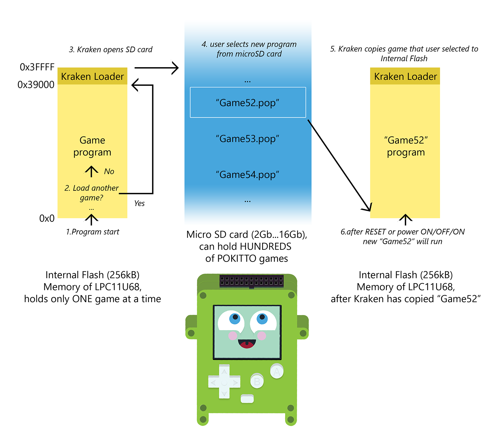

## The two different ways of loading games on Pokitto

Pokitto is based on a simple cpu that is used in things like microwave ovens.

It has a small internal "flash" memory that stores the complete game. The flash memory is 256kB, about the size of a thumbnail picture on your computer. For this reason, the flash memory only holds *one* game at a time.

In order for you to run a different program, the program has to be *loaded* into the flash memory in one of the following ways:

### Method 1. Loading a game from a microSD card using the Kraken loader

The game loader, **Kraken** (by bl_ackrain), is a small piece of code that lives above the game program (like someone living in the attic of a house).

When you press 'C' (the smallest button in the front of Pokitto) during startup when prompted, the Pokitto processor jumps to the attic to the loader code.

In Kraken, after you have chosen the game you want to load, the loader copies that game from **SD card** into the **FLASH** memory below the loader. 

When Pokitto is restarted, it begins running the new game.

{: width="600px"}

### Method 2. Loading a game directly from computer to Pokitto through a USB cable 

Updating the memory of your Pokitto can be done directly from a PC. You do not need a MicroSD card, but you need a Windows/Mac/Linux computer and a USB cable.

What happens in this method is the following:
- Pokitto is connected to the PC with a USB cable 
- Pokitto is put into a special "flash" mode by using the buttons at the back of Pokitto
- Pokitto appears as a USB flash drive on the computer. It is called CRP_DISABLD and contains one file "firmware.bin"
- firmware.bin is deleted
- a raw program/game file, called a "binary file" (ends in ".bin") is copied into the CRP_DISABLD drive
- Pokitto is restarted in normal mode

#### Understanding Pokitto memory in detail

Pokitto has 4 kinds of memory, in order of size from smallest to largest:

1. 4kB of EEPROM memory
  - EEPROM memory is very small. It is used to store highscores and system settings
2. 36kB of RAM memory
  - RAM memory is the "working memory" of Pokitto, that is used for calculations when games are running
  - RAM memory is emptied every time device is switched off. It can not store data permanently
3. 256kB of FLASH memory
  - FLASH memory is where the actual program is running from
  - FLASH keeps the current program even when Pokitto is OFF
  - Every program needs to fit into the FLASH. Because the game loader also needs space, programs need to be 220kB or less
4. 2GB or bigger SD card (when comes with Pokitto)
  - SD card can hold as many games as you want and will fit on the SD card
  - SD card also has music and other data that is needed by the games
  - the loader gets games from the SD card and loads them into FLASH

